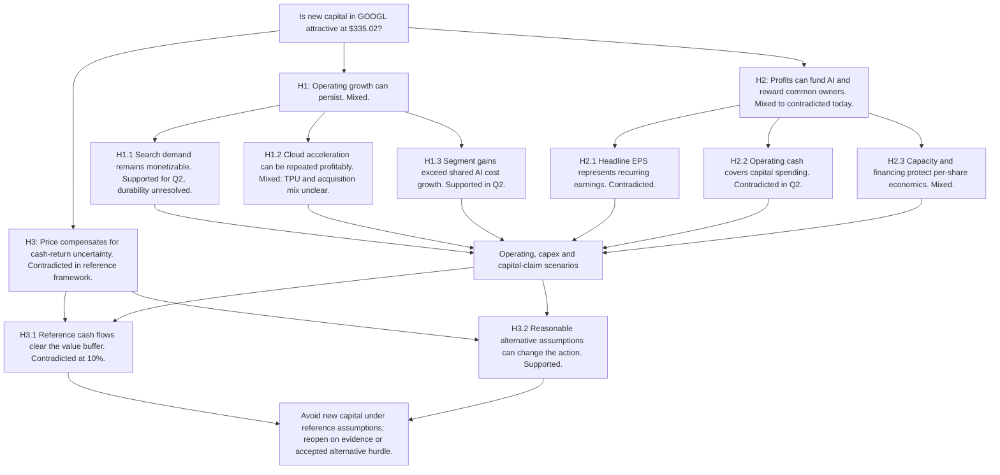

# Alphabet investment thesis: production plan revision 3

Status: user-authorized repaired production plan. The original first packet remains unchanged in `story/`. Production uses the exact on-slide copy in `candidate-05/deck-plan.json` and `storyboard-v4.md`; this title/dash plan records the governing argument. This revision clarifies existing FCFF discounting as an assumed enterprise WACC and narrows the financing title. Numeric scenarios and decision rules are unchanged. It requires a fresh complete-packet review, not a retrospective first-pass acceptance claim.

## Communication setup

After this deck, the investment committee should decide whether to commit new capital to Alphabet Class A at the 1 September 2026 price because the deck distinguishes the attractive operating trajectory from the cash returns and assumptions required by valuation.

Audience: investment committee. Delivery: executive pre-read, intelligible without narration. Main question: does GOOGL at $335.02 offer adequate value after removing investment gains and funding its AI commitments? Horizon: five-year operating scenarios with an explicit terminal value, reviewed at the next earnings event. The stock-price snapshot is 1 September 2026, 16:00 New York. Operating information stops at the 22 July release and 30 June 10-Q, filed 23 July.

Governing answer: **Avoid a new position at $335.02 under the proposed 10% reference valuation framework: Search and Cloud growth are credible, but cash conversion is weak and the illustrative $185 reference value already assumes substantial capital efficiency; sustained upside growth and a lower 8% discount rate would reverse the decision.**

This is a conditional new-money investment conclusion. It is not a claim that the stock will decline 45%, a trade instruction, or a recommendation about an undisclosed existing holding. The analyst-proposed action rule is Buy at value/price ≥1.2, Hold at 0.8 to <1.2, Avoid below 0.8. The committee must choose an assumed enterprise WACC and operating case; those policies were not supplied. The enterprise WACC is not an equity return requirement or empirical market estimate. The 10% reference and 8%–12% sensitivity range are illustrative policy assumptions, not a demonstrated appropriate market range; the model and action remain conditional on their adoption.

No registered template precisely matches a listed public-equity underwriting decision. Commercial due diligence would contribute operating tests but would not supply the earnings normalization, financing, per-share and market-price disciplines required here. Accordingly, this plan follows the Storylining owner directly rather than force a transaction template or combine chapter systems.

## Hypothesis logic

The decision has three jointly necessary tests: business earnings must endure, those earnings must become distributable cash after funding obligations, and the price must compensate for that uncertainty. H1 tests the operating engine, H2 tests earnings-to-owner-cash conversion, H3 translates the resulting cash range into an investment action. Risks in H1 and H2 flow into the scenario model in H3; they do not disappear in the recommendation.

| Test | Provisional answer and why it matters | Confirming / disconfirming test | Current state and consequence | Priority, disposition and dependency |
| --- | --- | --- | --- | --- |
| H1.1 | Search can fund the investment cycle because users and advertisers keep engaging. | Search +16.8%, paid clicks +13%, CPC +3%; test ongoing click growth, AI monetization and distribution remedies. | Supported in Q2, long-term durability untested. If false, margin-rich growth falls and the reference case weakens. | High, core slides 3 to 4 and 15. S1/S2; public AI unit economics unresolved. |
| H1.2 | Cloud can sustain outsized growth without surrendering profit to hardware and infrastructure costs. | Revenue +81.8%, margin 35.6%, backlog 513.9; distinguish TPU sale and Wiz contribution from underlying services. | Mixed. If true, upside valuation becomes credible; if false, both growth and capital utilization weaken. | High, core slides 3, 5, 12. Organic/TPU split unavailable; next company disclosure is resolution path. |
| H1.3 | Segment profit gains can exceed corporate AI expense growth. | Bridge 31.271 to 40.770 OI; Services +6.481, Cloud +5.988, corporate -2.417, Bets -0.553. | Supported for Q2. If false later, Cloud segment margin overstates value to common owners. | High, core slide 6; costs carried into every scenario. |
| H2.1 | Reported EPS is a useful recurring earnings base. | Remove company-disclosed 6.26 gain effect from 9.11 EPS; inspect taxes, legal charges and financing. | Contradicted. Gain-stripped EPS 2.85 is a narrower diagnostic, not fully normalized EPS. | High, core slide 7; full reconciliation appendix 17. |
| H2.2 | Cash generated by operations covers AI capital needs and economic compensation. | Q2 CFO 39.069 vs capex 44.924; H1 FCF 4.261 vs 24.254 prior; H1 FCF less SBC -10.447. | Contradicted today, future recovery untested. Failure keeps funding external and raises the value hurdle. | Highest, core slides 8 to 9, 12 to 14; S1/S2, analyst schedules. |
| H2.3 | Balance-sheet capacity can absorb obligations without impairing common-share value. | Strip restricted equities from liquidity, reconcile all debt, preferred, capital issuance, purchase commitments and contingent exposures. | Mixed. Liquid resources are substantial but new financing and commitments make cash capacity different from reported asset wealth. | High, core slides 10 to 11; appendix 19. Timing/expense split unresolved, modeled capex stress captures consequences. |
| H3.1 | The reference operating path offers sufficient value at the snapshot price. | Compare current price against cash-flow values after all capital claims at one discount/growth convention. | Contradicted at 10%/3%: reference 184.63 vs 335.02. New capital fails analyst value buffer. | Highest, core slides 12 to 14 and 16. Model is illustrative, no probability-weighted expected value. |
| H3.2 | The investment action is robust to plausible alternatives. | 8%/3% reference 270.13, upside 444.47; capex +5pp 134.62; Search -5pp 165.29. | Mixed rather than robust. Hurdle/case choice can reverse action, so recommendation must retain the condition. | Highest, core slides 14 to 16. Committee must accept assumptions; analyst refreshes at review event. |

No material branch is parked. Geography and broad peer multiples are omitted because this exercise lacks an admitted comparable peer financial dataset and neither resolves the principal cash-return test. Other Bets receives no speculative standalone option value; its reported loss remains in cash flows. This is conservative, disclosed, and reversible with evidence.

## Section and navigation map

Visible tracker: **none**. The title spine provides orientation in this 16-page main argument. There are no contents or section-divider pages; adding them would repeat the title sequence without helping the committee. Section IDs below are planning traceability only and do not become audience labels.

| Section ID | Section logic | Slides | Hypothesis |
| --- | --- | --- | --- |
| opening | Recommendation and proof outline | 1 to 2 | H1 to H3 |
| operating | Test the business growth engine | 3 to 6 | H1 |
| cash | Translate earnings into owner cash and funding needs | 7 to 11 | H2 |
| valuation | Price the cash scenarios and test reversal | 12 to 14 | H3, incorporating H1/H2 |
| decision | Monitor disconfirming evidence and state the action | 15 to 16 | H1 to H3 |
| appendix | Preserve normalization, assumptions and capital-claim detail | 17 to 19 | H2/H3 |

## Complete exact-title dot-dash, in production order

### Opening

1. **Dot:** Alphabet Class A: avoid new capital at $335 under the reference valuation
   - **Dash:** Investment committee pre-read after Q2 2026. Price $335.02 at 1 September 2026 close; operations through the specified July release and June-quarter 10-Q.
   - **Dash:** Subtitle carries the condition: “Strong operating growth does not yet establish adequate cash returns at a 10% discount rate.” No decorative hero image.

2. **Dot:** Executive summary
   - **Dash:** Three stacked themes connect strong Search/Cloud results, weak common-owner cash conversion, and a valuation conditional on capital efficiency and hurdle rate. Each has two substantive bullets; exact proposed copy is in the storyboard.
   - **Dash:** One closing action: avoid new capital under the reference assumptions; revisit when cash evidence improves or the committee accepts the stronger growth and lower-return countercase.

### Operating

3. **Dot:** Cloud and Search supplied 87% of Alphabet's $23.4 billion revenue increase
   - **Dash:** Q2 2025 to Q2 2026 growth-contribution bridge: Search +9.417pp, YouTube +1.306pp, Network -0.053pp, subscriptions/platforms/devices +1.771pp, Cloud +11.557pp, Other Bets +0.009pp and hedging +0.226pp = 24.233% total growth.
   - **Dash:** Cloud contributes 47.7% of the dollar increase, Search 38.9%. Constant-currency growth of 23% versus reported 24% indicates currency does not explain the main acceleration. S1 pp1 to 2.

4. **Dot:** Search growth shows current demand durability, while AI unit economics remain unproven
   - **Dash:** Q2 Search revenue +16.8%, paid clicks +13%, CPC +3%; Search TAC rate substantially consistent. Rounded click and CPC changes imply approximately 16.4% combined growth, not an exact accounting bridge.
   - **Dash:** Evidence-and-limits comparison separates commercial engagement from unreported AI revenue per query and serving cost; Search distribution/data-sharing remedies remain material. S2 MD&A pp47 to 48, Note 10.

5. **Dot:** Cloud reached 35.6% margin, but its 82% growth includes a changing revenue mix
   - **Dash:** Native editable paired revenue/margin view: Q2 2025 13.624 / 20.7%; Q1 2026 20.028 / 32.9%; Q2 2026 24.768 / 35.6%. Q1 to Q2 growth rates 63.4% to 81.8% YoY are labeled only for those quarters.
   - **Dash:** TPU system sales begin in Q2, and Wiz is consolidated after March. Cloud backlog of 513.9 supports demand but does not isolate services retention, organic growth or hardware margins. S1/S2.

6. **Dot:** Segment profit gains outweighed $3.0 billion of additional central and Other Bets losses
   - **Dash:** Operating-income bridge from 31.271 to 40.770: Services +6.481, Cloud +5.988, Other Bets -0.553, Alphabet-level -2.417.
   - **Dash:** Consolidated incremental operating margin is 40.6%, but central expense increased 71.7%; segment Cloud margins cannot be applied to the whole AI enterprise. S1 p2.

### Cash

7. **Dot:** Removing equity gains cuts Q2 EPS from $9.11 to $2.85 before further normalization
   - **Dash:** Company-disclosed investment-gain EPS effect is 6.26 and net-income effect is 77.1. Show the EPS subtraction as an editable bridge with the gain-stripped result explicitly labeled analyst arithmetic.
   - **Dash:** Annualizing the gain-stripped quarter implies 29.4× earnings at the snapshot price; this is a run-rate check, not TTM or forward P/E. Legal costs, financing, tax and mix remain; no blanket recurring-EPS claim. S1 p9/S2.

8. **Dot:** H1's $174.8 billion net income produced only $4.3 billion of free cash flow
   - **Dash:** Cash bridge: NI 174.771, reverse securities gains -135.803, deferred taxes +27.538, depreciation +13.586, SBC +14.708, other noncash +3.161, working capital/taxes -13.102, CFO subtotal 84.859, capex -80.598, FCF 4.261.
   - **Dash:** FCF is 5.0% of CFO versus 38.0% in H1 2025. Treating SBC as an economic cost leaves -10.447, an analyst diagnostic rather than GAAP cash flow. S2 p9.

9. **Dot:** Capital spending overtook operating cash flow in Q2 as depreciation lagged investment
   - **Dash:** Native paired CFO/capex columns across Q3 2025 to Q2 2026 show the crossover: Q2 CFO 39.069, capex 44.924, FCF -5.855. Earlier FCF was 24.461, 24.551 and 10.116.
   - **Dash:** H1 capex 80.598 was 5.9× depreciation 13.586. Future depreciation and utilization must be tested together; low current depreciation cannot prove low capital cost. S1 p9/S2 MD&A.

10. **Dot:** Excluding equity investments reduces headline liquidity from $242.5 billion to $155.4 billion
    - **Dash:** Liquidity bridge separates current equity 87.063 from cash/debt securities. An additional 14.126 of long-term marketable equity sits outside the headline total; neither is counted twice.
    - **Dash:** Most current marketable equity is restricted SpaceX stock; debt face value is 101.085 and preferred liquidation claims are 19.25. Portfolio wealth supports value but does not substitute for unrestricted operating liquidity. S2 Notes 3/6/11.

11. **Dot:** New financing expanded resources, but added claims and commitments keep marginal-return evidence essential
    - **Dash:** H1 common/preferred proceeds 49.562 plus debt issuance net of repayment 50.973 supported cash needs; no buybacks occurred. SBC-related cash payments were 12.056.
    - **Dash:** Compare 811.0 of purchase/contractual obligations, including 200.7 short term, with funding structure and conditional exposures. ATM 40.0 is unused authorization, not cash; commitments are not all incremental debt. S2 cash flow, Notes 4/10/11, MD&A p54.

### Valuation

12. **Dot:** The reference case needs cash recovery even after Cloud grows to $419 billion
    - **Dash:** Year 1 to Year 5 reference cash flow rises from -39.8 to +202.4 while Cloud reaches 419.2 and capex/revenue falls from 40% to 20%; Year 5 group margin is 35.0%.
    - **Dash:** Show the annual cash recovery and its decisive assumptions together. All five-year paths are illustrative scenarios, not company or consensus forecasts. Corporate AI costs, SBC, working capital and capital spending stay in the model.

13. **Dot:** At a 10% discount rate, all three illustrative values fall below the $335 snapshot
    - **Dash:** Native editable valuation comparison: downside 50.02, reference 184.63, upside 303.45, with a common 335.02 price marker. Valuation gaps are -85.1%, -44.9% and -9.4%; not expected one-year returns.
    - **Dash:** All cases use 3% perpetual growth and reconciled equity claims. Terminal value supplies 89% of reference enterprise value, so $185 is a sensitivity result rather than a precise target.

14. **Dot:** A lower assumed WACC can reverse the decision, while persistent capex widens the shortfall
    - **Dash:** At 8%/3%, reference value 270.13 moves from Avoid to Hold under the proposed buffer rule; the upside case at 444.47 supports Buy if adopted. Reference at 10% remains 184.63.
    - **Dash:** Persistent capex/revenue +5pp cuts reference to 134.62; Search growth -5pp cuts it to 165.29. Show these separately from hurdle sensitivities so the committee can see which belief changes the action.

### Decision

15. **Dot:** Reopen the thesis when cash conversion, Cloud mix or distribution remedies change the model
    - **Dash:** Next earnings should test sustained Cloud services growth, margin after infrastructure cost, and CFO versus capex; operating results need to support the reference's cash recovery rather than just another GAAP EPS beat.
    - **Dash:** Material distribution/adtech remedy or financing disclosures can change Search growth, margin or the common-share bridge before that event. State the model consequence and owner for each trigger; do not invent calendar dates or company targets.

16. **Dot:** Avoid new capital at $335 unless cash-return evidence or the accepted hurdle changes
    - **Dash:** Search and Cloud provide a credible operating counterweight to the cautious valuation, but the reference case already requires revenue above $1 trillion and lower capital intensity to reach $185 at 10%.
    - **Dash:** The strongest countercase reaches $444 at 8%; accepting it is a consequential change in underwriting assumptions. The committee should retain the conditional Avoid decision and assign the investment analyst to refresh at the next earnings or material remedy/financing disclosure.

### Appendix

17. **Dot:** Earnings and cash definitions separate reported performance from analyst adjustments
    - **Dash:** Table reconciles GAAP EPS, disclosed investment effect, gain-stripped EPS, company FCF and the economic-SBC diagnostic with exact formulas and limits; cited primary pages support each input.

18. **Dot:** Five-year scenarios retain AI costs, capital spending and working-capital requirements
    - **Dash:** The reference annual cash schedule appears in an editable analytical table; complete scenario driver arrays and all-case calculations remain attached as `calculations.json` and the model memo. Clearly label rolling years and the Q2 annualized anchor.

19. **Dot:** The equity bridge counts investment assets and capital claims once
    - **Dash:** Reconcile liquid resources, haircutted investments, current/noncurrent debt, finance leases, preferred proxy, legal/tax/funding reserves and backstop reserves. Explain commitment overlap and the simplified preferred treatment without hiding either.

## Coverage and planned handoff

Growth quality and Search durability: 3 to 4. Cloud acceleration/profitability: 5. Operating leverage: 6. Earnings quality: 7 and 17. AI capital intensity and FCF conversion: 8 to 9 and 12. Balance-sheet capacity and dilution: 10 to 11 and 19. Valuation and reversal: 12 to 14 and 18. Catalysts and disconfirming evidence: 15. Explicit conclusion: 1, 2, 16.

Every planned slide is represented above. Exact titles are repeated verbatim in `storyboard.md`. Source ledger and analytical assumptions are part of this same packet. Native editable charts are proposed for the required revenue bridge, Cloud revenue/margin, cash bridge and scenario valuation comparison. Production contracts, platform selection, render QA and editable-file verification remain deferred because this deliverable stops at planning.
