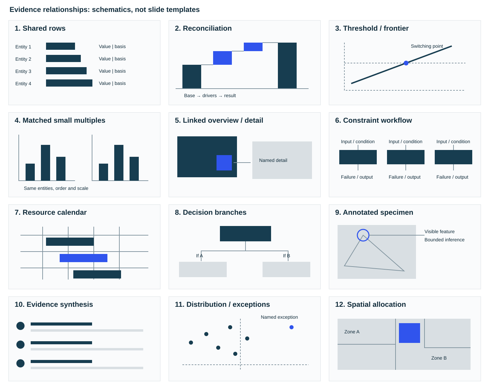

# Reference atlas: relationships before layouts

Use this atlas during exhibit selection. The original schematics below explain relationships; they are not cropped reference slides, component screenshots or fixed templates. [Design](design.md) owns selection and treatment, [Composition](composition.md) the native building blocks.

| Relationship | Evidence needed and design move | Counterexample |
| --- | --- | --- |
| Shared rows | Common entity keys; align marks, exact values, drivers and basis on each row. Useful when the reader must combine these fields. | Unrelated entities aligned only to look symmetrical. |
| Reconciliation | A defined base and movements that reproduce the result; attach the reason to each movement. | Unrelated quantities made into a waterfall, or an arithmetic allocation called causal. |
| Threshold / frontier | A real decision threshold or two meaningful variables; show switching point and feasible region. | Invented scores/axes, target hidden in commentary, one-variable sensitivity presented as a joint feasible case. |
| Matched small multiples | Same entity order, denominator and physical scale; use parallel plots for a meaningful contrast. | Separate auto-scales that make equal values look unequal. |
| Linked overview / detail | A keyed parent set and necessary decomposition, with explicit visual connection. | A second panel rereading the first. |
| Constraint workflow | Actual stage inputs/outputs, actors, enabling conditions and failure boundaries. Attach conditions to the affected stream or transition, as in the illustrative 40 = 30 + 10 split below. | Generic verbs in chevrons or independent alternatives disguised as stages. |
| Resource calendar | Shared time scale and competing lanes; distinguish trial and optional continuation. | Equal-width date labels for unequal elapsed time or a schedule with no resource collision to inspect. |
| Decision branches | Selectable conditions leading to named actions; preserve sequential steps within each route. | Boxes saying to research an unknown condition, or actions made into sibling choices. |
| Annotated specimen | Authorized/attributed visible evidence and precise feature-to-inference link. | Decorative image or a cover used to prove an entire publisher's style. |
| Evidence synthesis | Developed claim rows with decisive proof and consequence. Metrics optional. | Repeated metric strip, preview scorecard and second ending all saying the same thing. |
| Distribution / exceptions | Named observations, sample basis, quantile method; locate focal case against cohort spread. | Median alone called consistency; plausible inherited quartiles with no members. |
| Spatial allocation | Real geometry or an explicitly designed conceptual allocation whose adjacency/capacity matters. | Map-shaped decoration or invented geographical coordinates. |

## Devices worth transferring

Each device below was observed on strong client pages during development. They are described, not cited: the documents are not part of the skill, and nothing here is a pointer to retrieve.

| Device | What it makes easier |
| --- | --- |
| Budget bins, matched periods and aligned change values in one reading field | Reading level and change together without a second chart |
| Developed text synthesis with selective emphasis and no compulsory metric strip | Carrying an argument that has no single headline number |
| A named focal entity against a directly drawn peer benchmark | Locating the subject in its cohort at a glance |
| Comparator selection and shared stage/metric evidence | Showing why these comparators, on one basis |
| Concern, test and finding aligned as one argument | Following a claim from worry to verdict on one row |
| Stable categories compared across two periods | Change in mix without re-reading the legend |
| Amount, competing estimate, driver and method joined; recurring and one-time effects separated | Trusting a number by seeing how it was built |
| Enablers and detractors attached to actual workflow stages | Seeing where in a process a condition bites |
| Category definitions aligned beneath marks; the aggregate separated from its components | Reading what each bar contains |
| Mechanism, magnitude and evidence confidence on common rows | Weighing claims by how well they are supported |

Do not import reference styling that conflicts with the brief. In particular positive/negative chart colours, extra title bands or dense legacy typography are not prescribed by these devices. When the user supplies reference decks, record their strongest device, what it makes easier and whether the candidate preserves or improves that function.

## Worked selection

A title about savings needs released hours, schedulable hours, cancellable hours and the contract floor together. Candidate A: four charts with separate caveats. Candidate B: shared-row feasible-capacity reconciliation with the contract boundary attached. Choose B when it removes mental joins; split only if the actual records cannot remain readable. A second plot can then show a genuinely different uncertainty or time dependency.

A taxonomy of event classes benefits from filled category cells. A roster of individual events does not become a taxonomy because it occupies the first column. Keep those two examples together when testing the treatment rule.
